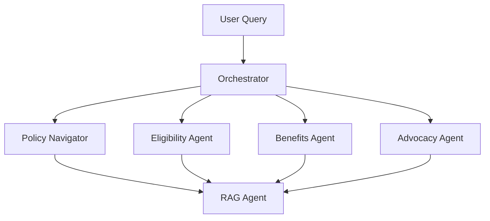

# Civic Assistance Agent System (Zynd)

A production-grade multi-agent system designed to navigate Indian government policies, schemes, and benefits using LangGraph and LangChain.

**🌟 Live Demo:** [https://huggingface.co/spaces/Darshankumarr03/JanSahayak](https://huggingface.co/spaces/Darshankumarr03/JanSahayak)

## 🎯 Features

- **Four Specialized AI Agents**:
  - **Policy Navigator**: Interprets complex policies and extracts eligibility rules.
  - **Eligibility Verifier**: Verifies citizen eligibility and provides clear verdicts.
  - **Benefits Matcher**: Discovers and ranks applicable benefits based on priority.
  - **Advocacy Guide**: Offers step-by-step application guidance and document checklists.
- **Agentic RAG**: Intelligent, context-aware document retrieval with caching.
- **Structured Outputs**: Pydantic models ensure consistency and predictability.
- **Session Persistence**: Maintains conversation history for seamless interactions.
- **Streamlit Interface**: Real-time visualization of agent thought processes.

## 🏗️ Architecture



## 🚀 Quick Start

### Prerequisites
- Python 3.10+

### Installation

```bash
# Clone the repository
git clone https://github.com/Darshanroy/zynd-hackathon-prod.git
cd zynd-hackathon-prod

# Create and activate virtual environment
python -m venv venv
# On Windows
venv\Scripts\activate
# On macOS/Linux
source venv/bin/activate

# Install dependencies
pip install -r requirements.txt
```

### Configuration

Create a `.env` file in the root directory:
```bash
# Required API Keys
GOOGLE_API_KEY=your_google_api_key
GROQ_API_KEY=your_groq_api_key

# Optional - LangSmith Tracing
LANGCHAIN_API_KEY=your_langsmith_key
LANGCHAIN_TRACING_V2=true
LANGCHAIN_PROJECT=civic-assistance-agent
```

### Running the Application

**Start the Streamlit Web Application:**
```bash
streamlit run src/streamlit_app.py
```

**Run in Console Mode:**
```bash
python src/main.py
```

## 📁 Repository Structure

```
zynd-protocals-application/
├── src/                    # Application source code
│   ├── agents.py           # Core agent definitions
│   ├── graph.py            # Main orchestrator logic (LangGraph)
│   ├── streamlit_app.py    # Streamlit web interface
│   ├── schemas.py          # Data models (Pydantic)
│   └── ...                 # Other specific agent components
├── tests/                  # Test scripts and query cases
│   ├── indian_test_queries.md
│   └── verify_*.py         # Verification and CLI test scripts
├── docs/                   # Additional documentation
├── agent_desc_md/          # Agent specifications and prompts
├── .env.example            # Environment variables template
├── requirements.txt        # Python dependencies
└── README.md               # This documentation
```

## 🔧 Technology Stack

- **Framework**: LangGraph, LangChain
- **Vector Database**: FAISS (Local) / ChromaDB
- **User Interface**: Streamlit
- **Embeddings**: HuggingFace (`all-mpnet-base-v2`)
- **Tracing & Evaluation**: LangSmith

## 🤝 Contributing

This project was originally built for the Zynd Hackathon and is open for community contributions. Feel free to open issues or submit pull requests.

## 📄 License

This project is licensed under the MIT License.
