```mermaid
graph TD
    A[👤 Telegram User] -->|Messages| B[🤖 Telegram Bot]
    
    B -->|/start /help /cancel| C[⚡ Command Handlers]
    B -->|Option Selection| D[💬 Conversation Handlers]
    
    D -->|Ask Questions| E[❓ Question Flow System]
    
    E -->|Validate Input| F[✅ Validators]
    E -->|Store Answers| G[📝 User Profile Builder]
    
    G -->|Profile + Query| H[🧠 Agent Graph<br/>Orchestrator]
    
    H -->|RAG Retrieval| I[(🗄️ ChromaDB<br/>Vector Store)]
    I -->|Policy Docs| H
    
    H -->|Route to Specialist| J1[📜 Policy Navigator]
    H -->|Route to Specialist| J2[✅ Eligibility Verifier]
    H -->|Route to Specialist| J3[💰 Benefits Matcher]
    H -->|Route to Specialist| J4[📢 Advocacy Agent]
    
    J1 -->|Response| K[📤 Response Generator]
    J2 -->|Response| K
    J3 -->|Response| K
    J4 -->|Response| K
    
    K -->|Format for Telegram| L[🎨 Telegram Markdown<br/>Formatter]
    
    L -->|Send Message| A
    
    style A fill:#4A90E2,stroke:#2E5C8A,color:#fff,stroke-width:2px
    style B fill:#52C41A,stroke:#389E0D,color:#fff,stroke-width:2px
    style H fill:#722ED1,stroke:#531DAB,color:#fff,stroke-width:3px
    style I fill:#FAAD14,stroke:#D48806,color:#fff,stroke-width:2px
    style L fill:#FF4D4F,stroke:#CF1322,color:#fff,stroke-width:2px
    style C fill:#13C2C2,stroke:#08979C,color:#fff
    style D fill:#13C2C2,stroke:#08979C,color:#fff
    style E fill:#1890FF,stroke:#096DD9,color:#fff
    style F fill:#52C41A,stroke:#389E0D,color:#fff
    style G fill:#722ED1,stroke:#531DAB,color:#fff
    style J1 fill:#FA8C16,stroke:#D46B08,color:#fff
    style J2 fill:#FA8C16,stroke:#D46B08,color:#fff
    style J3 fill:#FA8C16,stroke:#D46B08,color:#fff
    style J4 fill:#FA8C16,stroke:#D46B08,color:#fff
    style K fill:#EB2F96,stroke:#C41D7F,color:#fff
```

# Telegram Bot Architecture

## Component Descriptions

### Frontend Layer
- **👤 Telegram User**: End user interacting via Telegram app
- **🤖 Telegram Bot**: Python-telegram-bot application handling all Telegram interactions

### Handler Layer
- **⚡ Command Handlers**: Process commands like /start, /help, /cancel
- **💬 Conversation Handlers**: Manage multi-step conversations for the 4 main options

### Data Collection Layer
- **❓ Question Flow System**: Sequential question asking based on selected option
- **✅ Validators**: Input validation (age, income, locations, etc.)
- **📝 User Profile Builder**: Aggregates user answers into a profile

### Intelligence Layer
- **🧠 Agent Graph**: Central orchestrator routing to specialist agents
- **📜 Policy Navigator**: Explains policies and schemes
- **✅ Eligibility Verifier**: Checks if user qualifies for schemes
- **💰 Benefits Matcher**: Discovers all applicable benefits
- **📢 Advocacy Agent**: Provides application guidance

### Data Layer
- **🗄️ ChromaDB**: Vector database storing policy documents

### Response Layer
- **📤 Response Generator**: Aggregates agent outputs
- **🎨 Telegram Markdown Formatter**: Formats responses for Telegram display

## Data Flow

1. **User Interaction**: User sends message to Telegram bot
2. **Command/Conversation Routing**: Bot routes to appropriate handler
3. **Question Collection**: System asks questions based on selected option
4. **Validation**: Each answer is validated before acceptance
5. **Profile Building**: Answers aggregated into user profile
6. **Agent Invocation**: Profile sent to agent graph with query
7. **RAG Retrieval**: Agent queries ChromaDB for relevant policies
8. **Specialist Processing**: Appropriate specialist agent processes request
9. **Response Generation**: Agent generates detailed response
10. **Formatting**: Response formatted for Telegram (markdown, message splitting)
11. **Delivery**: Formatted message sent back to user

## Session Management

Each Telegram chat maintains its own session:
- User profile stored in memory per chat_id
- Conversation state tracked separately
- Session cleanup on /cancel or timeout
- Support for concurrent users

## Error Handling

- Input validation errors → Friendly retry prompts
- Agent timeouts → "Please try again" message
- Network errors → Automatic retry with exponential backoff
- Unknown commands → Help message with available options
