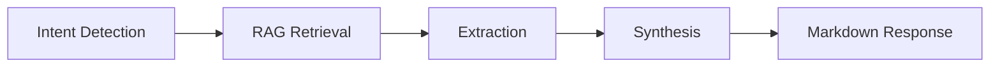
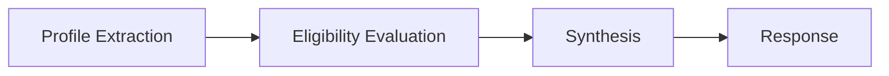
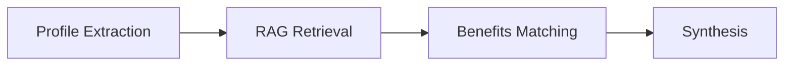
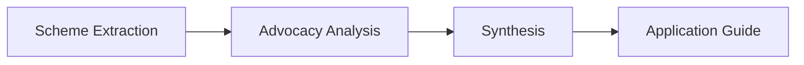

# Agents Reference

This document provides detailed information about each agent in the Zynd Protocols Application.

## 🎭 Agent Overview

The system contains **5 primary agents**, each with specialized capabilities:

| Agent | Purpose | Input | Output |
|-------|---------|-------|--------|
| **Orchestrator** | Routes queries to specialized agents | User query | Route decision |
| **Policy Navigator** | Interprets policy documents | Policy query | Structured analysis |
| **Eligibility Verifier** | Checks eligibility | Citizen info + scheme | Eligibility result |
| **Benefits Matcher** | Discovers benefits | Citizen profile | Matched benefits |
| **Advocacy Agent** | Application guidance | Scheme name | Step-by-step guide |

---

## 1️⃣ Orchestrator Agent

**File**: [`src/graph.py`](file:///c:/Users/bhara/Desktop/Projects/zynd-protocals-application/src/graph.py) (orchestrator_node)  
**Configuration**: [`src/agents.py`](file:///c:/Users/bhara/Desktop/Projects/zynd-protocals-application/src/agents.py) (orchestrator_agent)

### Purpose
The orchestrator is the **entry point** for all user queries. It analyzes the user's intent and routes the request to the appropriate specialized agent.

### Capabilities
- Intent classification
- Query routing
- Agent coordination

### Routing Logic

Detects user intent and maps to agent:

```
POLICY_INTERPRETER     → Policy Navigator
ELIGIBILITY_VERIFIER   → Eligibility Verifier
BENEFIT_MATCHER        → Benefits Matcher
CITIZEN_ADVOCATE       → Advocacy Agent
```

### Input
```python
{
    "messages": [HumanMessage(content="User query")],
    "input_text": "User query"
}
```

### Output
```python
{
    "current_intent": "POLICY_INTERPRETER"  # or other agent name
}
```

### Example Queries
- "What does the PM-KISAN scheme offer?" → `POLICY_INTERPRETER`
- "Am I eligible for Ayushman Bharat?" → `ELIGIBILITY_VERIFIER`
- "What benefits can I get?" → `BENEFIT_MATCHER`
- "How do I apply for this scheme?" → `CITIZEN_ADVOCATE`

---

## 2️⃣ Policy Navigator

**File**: [`src/policy_navigator.py`](file:///c:/Users/bhara/Desktop/Projects/zynd-protocals-application/src/policy_navigator.py)  
**State**: [`src/interpretation_state.py`](file:///c:/Users/bhara/Desktop/Projects/zynd-protocals-application/src/interpretation_state.py)  
**Schema**: `PolicyAnalysisOutput`

### Purpose
Interprets complex policy documents and extracts structured information in plain language.

### Workflow



### Nodes

#### 1. Intent Node
Determines user's specific intent:
- `policy_explanation` - What does the policy say?
- `eligibility_check` - Who qualifies?
- `benefit_analysis` - What do people get?
- `obligation_analysis` - What must be done?
- `risk_analysis` - What are the ambiguities?

#### 2. RAG Node
Retrieves relevant policy documents using the agentic RAG system.

#### 3. Extraction Node
Extracts structured data:
- **Metadata**: Policy name, authority, jurisdiction
- **Eligibility Rules**: Conditions, exceptions
- **Benefits**: Types, values, descriptions
- **Obligations**: Required actions, deadlines
- **Risk Analysis**: Ambiguities, missing info

#### 4. Synthesis Node
Converts structured analysis into user-friendly Markdown.

### Output Format

**JSON (Structured)**:
```json
{
  "metadata": {
    "policy_name": "PM-KISAN",
    "issuing_authority": "Ministry of Agriculture",
    "jurisdiction": "All of India"
  },
  "summary": "Direct income support for farmers",
  "eligibility_rules": [...],
  "benefits": [...],
  "obligations": [...],
  "risk_analysis": {...},
  "confidence_score": 0.95
}
```

**Markdown (User-facing)**:
```markdown
## PM-KISAN Scheme Summary

This scheme provides direct income support...

### Who Can Apply?
- Small and marginal farmers
- Land ownership required
...
```

### Use Cases
- Understanding policy details
- Identifying eligibility criteria
- Discovering obligations
- Finding ambiguities or risks

---

## 3️⃣ Eligibility Verifier

**File**: [`src/eligibility_verification.py`](file:///c:/Users/bhara/Desktop/Projects/zynd-protocals-application/src/eligibility_verification.py)  
**State**: [`src/eligibility_state.py`](file:///c:/Users/bhara/Desktop/Projects/zynd-protocals-application/src/eligibility_state.py)  
**Schema**: `EligibilityAnalysisOutput`

### Purpose
Determines if a citizen qualifies for a specific scheme based on their profile.

### Workflow



### Nodes

#### 1. Profile Extraction
Extracts citizen information from query:
- Age
- Income
- Category/Caste
- Location
- Education level
- Employment status

#### 2. Eligibility Evaluation
Analyzes against scheme rules:
- Checks each condition
- Identifies failed conditions
- Determines eligibility status
- Suggests matched benefits
- Lists required documents

#### 3. Synthesis
Creates empathetic, actionable response.

### Output Format

**JSON**:
```json
{
  "eligibility_result": {
    "status": "eligible",
    "reasoning": ["Age matches", "Income below threshold"],
    "failed_conditions": []
  },
  "matched_benefits": [...],
  "required_documents": ["Aadhaar", "Income Certificate"],
  "next_steps": [...],
  "appeal_guidance": {...}
}
```

**Markdown**:
```markdown
✅ You ARE Eligible!

### Why You Qualify
- Your age (35) meets the requirement
- Your income is below the threshold

### What You'll Get
- Monthly benefit of ₹500
...
```

### Use Cases
- Quick eligibility checks
- Understanding why someone does/doesn't qualify
- Getting document checklists
- Appeal guidance

---

## 4️⃣ Benefits Matcher

**File**: [`src/benefits_matching.py`](file:///c:/Users/bhara/Desktop/Projects/zynd-protocals-application/src/benefits_matching.py)  
**State**: [`src/benefits_state.py`](file:///c:/Users/bhara/Desktop/Projects/zynd-protocals-application/src/benefits_state.py)  
**Schema**: `BenefitsAnalysisOutput`

### Purpose
Discovers **all** benefits a citizen qualifies for based on their profile.

### Workflow



### Nodes

#### 1. Profile Extraction
Same as Eligibility Verifier.

#### 2. Benefits Matching
- Retrieves all relevant schemes via RAG
- Evaluates citizen against each scheme
- Prioritizes benefits by impact
- Identifies how to claim each
- Detects conflicts or mutual exclusions

#### 3. Synthesis
Creates comprehensive benefits guide.

### Output Format

**JSON**:
```json
{
  "eligible_benefits": [
    {
      "scheme_name": "Ayushman Bharat",
      "benefit_type": "Health Insurance",
      "benefit_value": "₹5 lakhs coverage",
      "priority_rank": 1,
      "confidence_score": 0.92,
      "why_you_qualify": [...],
      "how_to_claim": {...}
    }
  ],
  "conflicts_or_exclusions": [...]
}
```

**Markdown**:
```markdown
🎉 You qualify for 3 benefits!

## 1. Ayushman Bharat (High Priority)
**What it is**: Health insurance coverage

**Why you qualify**:
- Income below threshold
- Family size matches

**How to claim**:
1. Visit nearest healthcare center
2. Provide Aadhaar...
```

### Use Cases
- Discovering unknown benefits
- Prioritizing which benefits to claim
- Understanding benefit combinations
- Avoiding conflicting claims

---

## 5️⃣ Advocacy Agent

**File**: [`src/advocacy_agent.py`](file:///c:/Users/bhara/Desktop/Projects/zynd-protocals-application/src/advocacy_agent.py)  
**State**: [`src/advocacy_state.py`](file:///c:/Users/bhara/Desktop/Projects/zynd-protocals-application/src/advocacy_state.py)  
**Schema**: `AdvocacyAnalysisOutput`

### Purpose
Provides step-by-step guidance on **how to actually apply** for and receive benefits.

### Workflow



### Nodes

#### 1. Scheme Extraction
Identifies the specific scheme to apply for.

#### 2. Advocacy Analysis
Generates comprehensive application guidance:
- **Application Path**: Online portal, office visit, or hybrid
- **Document Status**: What's ready, what's missing, high-risk docs
- **Submission Guidance**: Step-by-step instructions, common mistakes
- **Post-Submission**: Expected timelines, status meanings
- **Appeal Support**: How to appeal if rejected

#### 3. Synthesis
Creates supportive, encouraging guide with checklists.

### Output Format

**JSON**:
```json
{
  "selected_scheme": "PM-KISAN",
  "application_path": {
    "mode": "online",
    "portal_or_office": "pmkisan.gov.in",
    "deadline": "March 31, 2026"
  },
  "document_status": {
    "ready": [],
    "missing": ["Land ownership certificate"],
    "high_risk": ["Bank account details"]
  },
  "submission_guidance": {...},
  "appeal_support": {...}
}
```

**Markdown**:
```markdown
# Your Application Guide for PM-KISAN

I'm here to help you apply successfully! 🌾

## Step 1: Gather Documents

✅ **You have:**
- Aadhaar Card

⚠️ **Still needed:**
- Land ownership certificate
- Bank account passbook

## Step 2: Online Application
1. Visit pmkisan.gov.in
2. Click "Farmer Corner"...
```

### Use Cases
- First-time applicants
- Reducing application errors
- Understanding rejection reasons
- Navigating appeal processes

---

## 🔧 Agent Configuration

All agents share common infrastructure defined in [`src/agents.py`](file:///c:/Users/bhara/Desktop/Projects/zynd-protocals-application/src/agents.py):

### LLM
```python
from langchain_groq import ChatGroq

llm = ChatGroq(
    model="llama-3.3-70b-versatile",
    temperature=0,
    groq_api_key=os.getenv("GROQ_API_KEY")
)
```

### Tools
- `retrieve_policy` - RAG retrieval
- `check_eligibility_rules` - Rule checking
- `find_benefits_database` - Benefits search

### Prompts
System prompts defined in [`src/prompts.py`](file:///c:/Users/bhara/Desktop/Projects/zynd-protocals-application/src/prompts.py)

---

## 🎯 Best Practices

### When to Use Each Agent

| Scenario | Agent |
|----------|-------|
| "What is this scheme about?" | Policy Navigator |
| "Do I qualify for X?" | Eligibility Verifier |
| "What can I get?" | Benefits Matcher |
| "How do I apply?" | Advocacy Agent |

### Agent Limitations

- **No Real-time Data**: Agents work with pre-loaded documents
- **No External APIs**: Cannot check live databases
- **Confidence Scores**: Always provided, but not 100% guaranteed
- **Context Window**: Limited by LLM token limits

---

Next: [State Management](state-management.md) to understand data flow.
