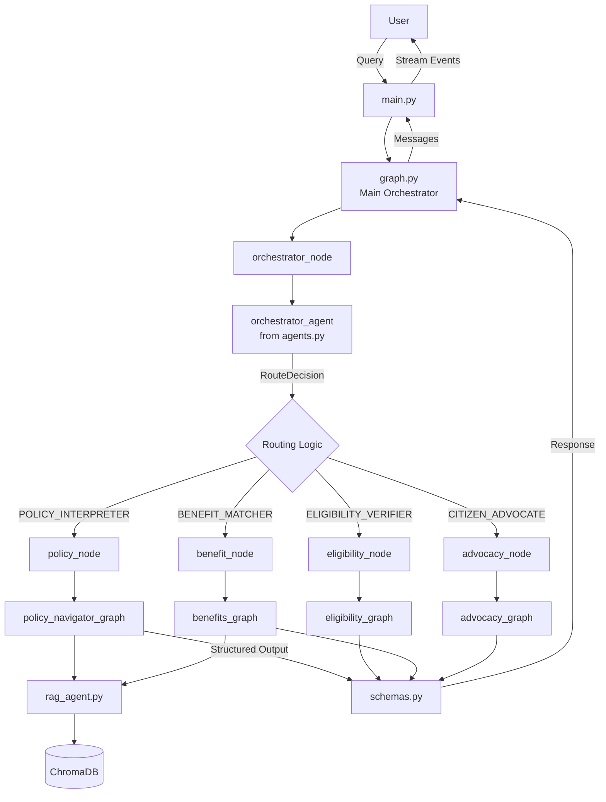

# System Architecture

This document describes the architecture of the Zynd Protocols Application, a multi-agent system built on LangGraph for civic assistance.

## 🏛️ Architectural Overview

The system follows a **hierarchical multi-agent architecture** where a central orchestrator routes requests to specialized domain agents, each implementing its own workflow.

### Core Design Principles

1. **Separation of Concerns** - Each agent handles a specific domain
2. **State Isolation** - Agents maintain independent state types
3. **Workflow Composition** - Agents combine as nodes in a larger graph
4. **Type Safety** - Structured outputs using Pydantic schemas
5. **Modularity** - Easy to add new agents or modify existing ones

## 🔄 System Layers

### Layer 1: Entry Point
**File**: [`main.py`](file:///c:/Users/bhara/Desktop/Projects/zynd-protocals-application/src/main.py)

- CLI interface for user interaction
- Session management with thread-based checkpointing
- Streaming output display
- Session history persistence to JSON logs

### Layer 2: Orchestration
**File**: [`graph.py`](file:///c:/Users/bhara/Desktop/Projects/zynd-protocals-application/src/graph.py)

The main orchestration graph that:
- Routes queries through the orchestrator agent
- Delegates to specialized subgraphs based on intent
- Manages tool execution and routing
- Maintains conversation state

### Layer 3: Specialized Agents (Subgraphs)

Each agent implements a complete LangGraph workflow:

#### Policy Navigator
**File**: [`policy_navigator.py`](file:///c:/Users/bhara/Desktop/Projects/zynd-protocals-application/src/policy_navigator.py)

```
Intent Detection → RAG Retrieval → Extraction → Synthesis
```

Interprets policy documents and extracts structured information.

#### Eligibility Verifier
**File**: [`eligibility_verification.py`](file:///c:/Users/bhara/Desktop/Projects/zynd-protocals-application/src/eligibility_verification.py)

```
Profile Extraction → Eligibility Evaluation → Synthesis
```

Determines if a citizen qualifies for specific schemes.

#### Benefits Matcher
**File**: [`benefits_matching.py`](file:///c:/Users/bhara/Desktop/Projects/zynd-protocals-application/src/benefits_matching.py)

```
Profile Extraction → Benefits Matching → Synthesis
```

Discovers all benefits a citizen qualifies for.

#### Advocacy Agent
**File**: [`advocacy_agent.py`](file:///c:/Users/bhara/Desktop/Projects/zynd-protocals-application/src/advocacy_agent.py)

```
Scheme Extraction → Advocacy Analysis → Synthesis
```

Provides step-by-step application guidance.

### Layer 4: Infrastructure

#### Agent Configuration
**File**: [`agents.py`](file:///c:/Users/bhara/Desktop/Projects/zynd-protocals-application/src/agents.py)

- LLM initialization (ChatGroq)
- Agent factory functions
- Tool binding
- Structured output configuration

#### RAG System
**Files**: [`rag.py`](file:///c:/Users/bhara/Desktop/Projects/zynd-protocals-application/src/rag.py), [`rag_agent.py`](file:///c:/Users/bhara/Desktop/Projects/zynd-protocals-application/src/rag_agent.py)

- Document retrieval from ChromaDB
- Agentic RAG with query refinement
- Context assembly and synthesis

#### State Management
**Files**: `state.py`, `advocacy_state.py`, `benefits_state.py`, `eligibility_state.py`, `interpretation_state.py`

Type-safe state definitions for each workflow.

#### Schemas
**File**: [`schemas.py`](file:///c:/Users/bhara/Desktop/Projects/zynd-protocals-application/src/schemas.py)

Pydantic models for structured LLM outputs.

#### Tools
**File**: [`tools.py`](file:///c:/Users/bhara/Desktop/Projects/zynd-protocals-application/src/tools.py)

Shared tools available to agents:
- `retrieve_policy` - RAG retrieval
- `check_eligibility_rules` - Eligibility lookup
- `find_benefits_database` - Benefits search

## 🔗 Data Flow Architecture



## 🧠 State Management Strategy

### Main State: `AgentState`
Used by the orchestrator graph to maintain overall conversation context:
- `input_text` - Current user query
- `current_intent` - Detected intent for routing
- `messages` - Full conversation history (with LangGraph's `add_messages`)
- Context fields (interpreted_policy, citizen_profile, etc.)

### Subgraph States
Each specialized agent uses its own state type:
- `InterpretationState` - Policy Navigator
- `EligibilityState` - Eligibility Verifier
- `BenefitsState` - Benefits Matcher
- `AdvocacyState` - Advocacy Agent

**Key Pattern**: Subgraphs receive simplified input from the main graph and return formatted responses.

## 🛠️ Technology Stack

| Component | Technology | Purpose |
|-----------|-----------|---------|
| **Framework** | LangGraph | Multi-agent orchestration |
| **LLM Provider** | Groq (ChatGroq) | Fast inference |
| **LLM Model** | llama-3.3-70b-versatile | Primary reasoning model |
| **Embeddings** | Google Generative AI | Document embeddings |
| **Vector Store** | ChromaDB | Document storage and retrieval |
| **Schemas** | Pydantic | Structured outputs |
| **Observability** | LangSmith | Tracing and debugging |
| **Logging** | Python logging | Application logs |

## 🎯 Design Patterns

### 1. Orchestrator Pattern
A central orchestrator agent routes requests to specialized agents based on intent detection.

### 2. Subgraph Composition
Each specialized agent is a complete LangGraph subgraph that can be invoked independently.

### 3. Structured Outputs
LLMs return Pydantic models instead of raw text for type safety and validation.

### 4. Agentic RAG
RAG system uses an agent to refine queries and synthesize results rather than simple retrieval.

### 5. Caching Layer
LLM responses are cached based on query and context hashes to improve performance.

### 6. Three-Phase Workflow
Most agents follow: **Extract → Analyze → Synthesize**

## 🔒 State Persistence

- **Conversation Memory**: LangGraph `MemorySaver` checkpointer
- **Thread ID**: Identifies unique conversation sessions
- **Session Logs**: JSON files in `logs/` directory

## 🚀 Performance Optimizations

1. **Fast LLM**: Groq provides 20x faster inference than Ollama
2. **Caching**: `cache_helper.py` prevents redundant LLM calls
3. **Streaming**: Results stream to user as they're generated
4. **Lazy Loading**: Agents only load when needed

## 🔧 Extensibility Points

To add a new agent:
1. Create a new state file (e.g., `new_agent_state.py`)
2. Define schemas in `schemas.py`
3. Build the subgraph (e.g., `new_agent.py`)
4. Add routing logic in `graph.py`
5. Update orchestrator prompt in `prompts.py`

## 📊 Error Handling

- Try-catch blocks around each node
- Fallback responses on failures
- Comprehensive logging with `logger.py`
- Graceful degradation (continue with partial data)

## 🔮 Future Architecture Enhancements

- **Human-in-the-Loop**: Request missing information from users
- **Agent-to-Agent Communication**: Direct collaboration between agents
- **Shared Context Pool**: Common knowledge base across agents
- **Conditional Routing**: Multi-hop routing based on intermediate results
- **Parallel Execution**: Run independent agents concurrently

---

For implementation details, see [Development Guide](development.md).
