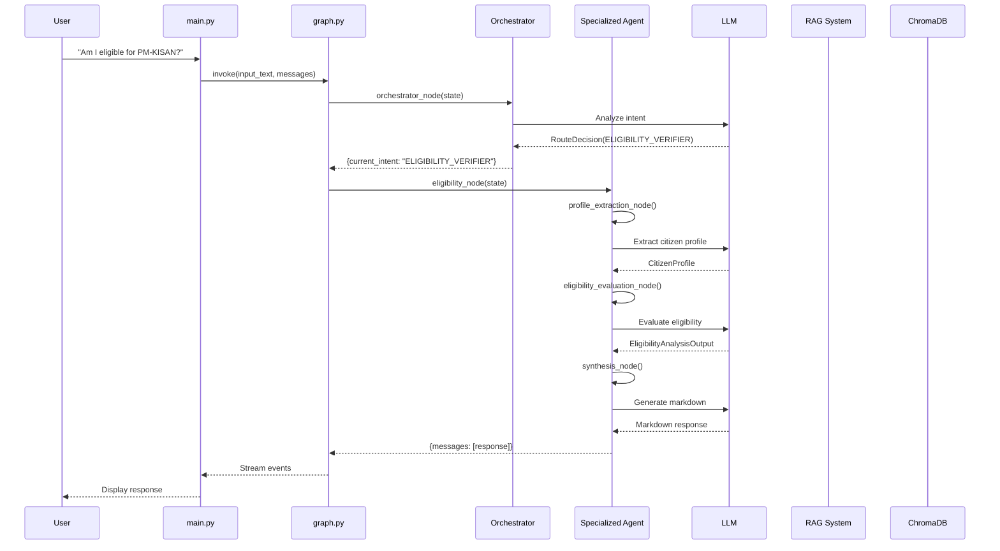
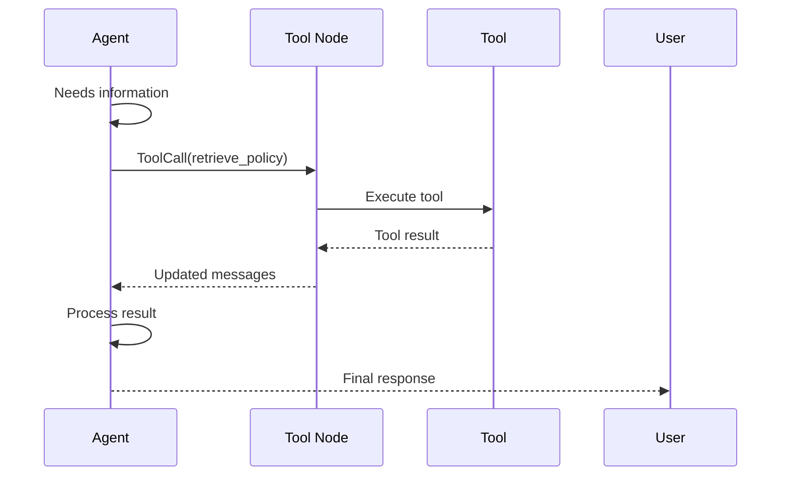

# Data Flow

This document illustrates how data flows through the Zynd Protocols Application with concrete examples.

## 🔄 Complete Request Flow

Here's a complete flow from user query to response:



## 📊 Example 1: Policy Query

### User Input
```
"What benefits does the PM-KISAN scheme provide?"
```

### Step-by-Step Flow

#### 1. Entry Point (main.py)
```python
inputs = {
    "input_text": "What benefits does the PM-KISAN scheme provide?",
    "messages": [HumanMessage(content="What benefits does the PM-KISAN scheme provide?")]
}

app.stream(inputs, config=thread_config)
```

#### 2. Orchestrator Detection
**State**:
```python
{
    "input_text": "What benefits does the PM-KISAN scheme provide?",
    "messages": [HumanMessage(...)],
    "current_intent": None
}
```

**Orchestrator Output**:
```python
RouteDecision(
    next_agent="POLICY_INTERPRETER",
    reason="User asking about policy benefits"
)
```

**Updated State**:
```python
{
    "current_intent": "POLICY_INTERPRETER",
    ...
}
```

#### 3. Policy Navigator Subgraph

**Subgraph Input**:
```python
{
    "input_text": "What benefits does the PM-KISAN scheme provide?"
}
```

**a) Intent Node**
```python
{
    "intent": "benefit_analysis"
}
```

**b) RAG Node**
```python
# Queries ChromaDB
query = "PM-KISAN benefits"
docs = retriever.invoke(query)

{
    "retrieved_docs": [
        Document(page_content="PM-KISAN provides income support of Rs. 6000 per year..."),
        Document(page_content="Benefits are distributed in three installments...")
    ]
}
```

**c) Extraction Node**
```python
# LLM extracts structured data
{
    "analysis_output": PolicyAnalysisOutput(
        metadata=PolicyMetadata(
            policy_name="PM-KISAN",
            issuing_authority="Ministry of Agriculture"
        ),
        benefits=[
            Benefit(
                benefit_type="monetary",
                description="Direct income support",
                value="Rs. 6000 per year"
            )
        ],
        confidence_score=0.95
    )
}
```

**d) Synthesis Node**
```python
{
    "final_markdown_response": """
## PM-KISAN Benefits

The PM-KISAN scheme provides:

### Direct Income Support
- **Amount**: ₹6,000 per year
- **Distribution**: Three installments of ₹2,000 each
- **Mode**: Direct bank transfer
...
    """,
    "final_json_response": {...}
}
```

#### 4. Return to Main Graph
```python
{
    "messages": [
        HumanMessage(content="What benefits..."),
        AIMessage(content="## PM-KISAN Benefits...")
    ]
}
```

#### 5. Stream to User
```
--- Agent Response ---

[POLICY_AGENT]: ## PM-KISAN Benefits

The PM-KISAN scheme provides:
...

----------------------
```

## 📊 Example 2: Eligibility Check

### User Input
```
"I'm a 45-year-old farmer with 2 acres of land. Am I eligible for PM-KISAN?"
```

### Flow

#### 1. Orchestrator Routes
```python
RouteDecision(
    next_agent="ELIGIBILITY_VERIFIER",
    reason="User asking about eligibility"
)
```

#### 2. Eligibility Subgraph

**a) Profile Extraction**
```python
CitizenProfile(
    age=45,
    income=None,
    category=None,
    location=None,
    education_level=None,
    employment_status="farmer"
)
```

**b) Eligibility Evaluation**
```python
EligibilityAnalysisOutput(
    eligibility_result=EligibilityResult(
        status="eligible",
        reasoning=[
            "Age requirement met (18-60)",
            "Owns agricultural land",
            "Small/marginal farmer category"
        ],
        failed_conditions=[]
    ),
    matched_benefits=[
        MatchedBenefit(
            scheme_name="PM-KISAN",
            benefit_type="Income Support",
            benefit_value="₹6,000/year",
            confidence_score=0.92
        )
    ],
    required_documents=[
        "Aadhaar Card",
        "Land ownership certificate",
        "Bank account details"
    ]
)
```

**c) Synthesis**
```markdown
✅ You ARE Eligible for PM-KISAN!

### Why You Qualify
- Your age (45) meets the requirement (18-60 years)
- You own agricultural land (2 acres)
- You qualify as a small/marginal farmer

### What You'll Get
- **Annual Amount**: ₹6,000
- **Payment Schedule**: Three installments of ₹2,000
- **Payment Mode**: Direct bank transfer

### Documents Needed
- ✅ Aadhaar Card
- ✅ Land ownership certificate
- ✅ Bank account details

### Next Steps
1. Visit the PM-KISAN portal: pmkisan.gov.in...
```

## 📊 Example 3: Benefits Discovery

### User Input
```
"I'm a 30-year-old woman, income ₹50,000/year, living in rural Maharashtra. What benefits can I get?"
```

### Flow

#### 1. Orchestrator Routes
```python
RouteDecision(
    next_agent="BENEFIT_MATCHER",
    reason="User seeking benefit discovery"
)
```

#### 2. Benefits Subgraph

**a) Profile Extraction**
```python
CitizenProfile(
    age=30,
    income=50000.0,
    category=None,
    location="Rural Maharashtra",
    education_level=None,
    employment_status=None
)
```

**b) RAG Retrieval + Matching**
```python
# RAG retrieves all relevant schemes
# LLM evaluates profile against each

BenefitsAnalysisOutput(
    eligible_benefits=[
        DetailedBenefit(
            scheme_name="Ayushman Bharat",
            benefit_type="Health Insurance",
            benefit_value="₹5 lakhs coverage",
            priority_rank=1,
            confidence_score=0.89,
            why_you_qualify=[
                "Income below ₹1 lakh threshold",
                "Rural resident"
            ],
            how_to_claim=BenefitClaim(
                steps=["Visit nearest healthcare center", ...],
                required_documents=["Aadhaar", "Income certificate"]
            )
        ),
        DetailedBenefit(
            scheme_name="PMJDY (Bank Account)",
            benefit_type="Financial Inclusion",
            priority_rank=2,
            ...
        )
    ],
    conflicts_or_exclusions=[]
)
```

**c) Synthesis**
```markdown
🎉 You qualify for 2 benefits!

## 1. Ayushman Bharat (High Priority)
**What it is**: Health insurance coverage up to ₹5 lakhs

**Why you qualify**:
- Your income (₹50,000) is below the threshold
- You live in a rural area

**How to claim**:
1. Visit your nearest primary healthcare center
2. Bring your Aadhaar card...

## 2. Pradhan Mantri Jan Dhan Yojana
...
```

## 📊 Example 4: Application Guidance

### User Input
```
"How do I apply for Ayushman Bharat?"
```

### Flow

#### 1. Orchestrator Routes
```python
RouteDecision(
    next_agent="CITIZEN_ADVOCATE",
    reason="User needs application guidance"
)
```

#### 2. Advocacy Subgraph

**a) Scheme Extraction**
```python
{
    "selected_scheme": "Ayushman Bharat"
}
```

**b) Advocacy Analysis**
```python
AdvocacyAnalysisOutput(
    selected_scheme="Ayushman Bharat",
    application_path=ApplicationPath(
        mode="offline",
        portal_or_office="Nearest empanelled hospital",
        deadline=None
    ),
    document_status=DocumentStatus(
        ready=[],
        missing=["Aadhaar", "Ration card/SECC data"],
        high_risk=["Income certificate"]
    ),
    submission_guidance=SubmissionGuidance(
        steps=[
            "Verify eligibility on mera.pmjay.gov.in",
            "Visit nearest empanelled hospital",
            "Present Aadhaar and ration card",
            ...
        ],
        common_mistakes=[
            "Not checking eligibility first",
            "Missing original documents",
            ...
        ]
    )
)
```

**c) Synthesis**
```markdown
# Your Application Guide for Ayushman Bharat

I'm here to help you apply successfully! 🏥

## Step 1: Check Eligibility
1. Visit mera.pmjay.gov.in
2. Enter your mobile number and Aadhaar
3. Verify your name appears in beneficiary list

⚠️ **If not listed**: You may not be eligible yet

## Step 2: Gather Documents

📋 **You will need**:
- Aadhaar Card (original + photocopy)
- Ration card OR SECC 2011 data
- Any government-issued ID

⚠️ **Common mistakes to avoid**:
- Don't bring just photocopies - originals required
...
```

## 🔁 State Transitions

### Main Graph State Evolution

```python
# Initial
{
    "input_text": "query",
    "current_intent": None,
    "messages": [HumanMessage("query")]
}

# After Orchestrator
{
    "input_text": "query",
    "current_intent": "POLICY_INTERPRETER",
    "messages": [HumanMessage("query")]
}

# After Specialized Agent
{
    "input_text": "query",
    "current_intent": "POLICY_INTERPRETER",
    "messages": [
        HumanMessage("query"),
        AIMessage("response")
    ]
}

# Multi-turn (next query)
{
    "input_text": "follow-up query",
    "current_intent": "ELIGIBILITY_VERIFIER",
    "messages": [
        HumanMessage("query"),
        AIMessage("response"),
        HumanMessage("follow-up query"),
        AIMessage("follow-up response")
    ]
}
```

## 🛠️ Tool Execution Flow

When an agent needs to call a tool:



**Example**:
```python
# Agent decides to call tool
AIMessage(
    content="",
    tool_calls=[{
        "name": "retrieve_policy",
        "args": {"query": "PM-KISAN benefits"}
    }]
)

# Tool Node executes
ToolMessage(
    content="Retrieved documents: ...",
    tool_call_id="123"
)

# Agent processes tool result
AIMessage(
    content="Based on the documents, PM-KISAN provides..."
)
```

## 🔄 Conversation Memory Flow

Thanks to checkpointing:

```python
# Turn 1
User: "What is PM-KISAN?"
Agent: "PM-KISAN is a farmer income support scheme..."

# Turn 2 (uses memory)
User: "How do I apply for it?"
Agent: "To apply for PM-KISAN (which we just discussed)..."
       # Agent has context from previous turn
```

## 📈 Performance Optimizations in Flow

### 1. Caching
```python
# First query: Full LLM call
cache_key = hash_query("PM-KISAN benefits", context)
result = llm.invoke(...)
cache[cache_key] = result

# Second identical query: Cache hit
cached_result = cache.get(cache_key)  # Instant!
```

### 2. Streaming
```python
# Results stream as generated
for event in app.stream(inputs):
    # User sees partial results immediately
    print(event)
```

## 🎯 Key Takeaways

1. **Hierarchical**: Main graph → Orchestrator → Specialized subgraph
2. **State Isolation**: Each subgraph has independent state
3. **Message-based**: Responses returned as messages in conversation
4. **Checkpointed**: Full conversation history maintained
5. **Cached**: Repeated queries use cached results
6. **Streaming**: Results delivered progressively

---

Next: [Development Guide](development.md) for extending the system.
